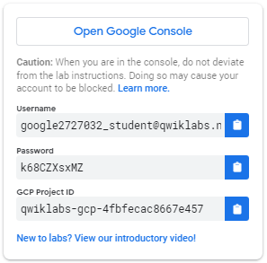
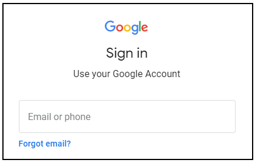
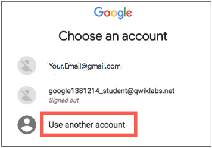
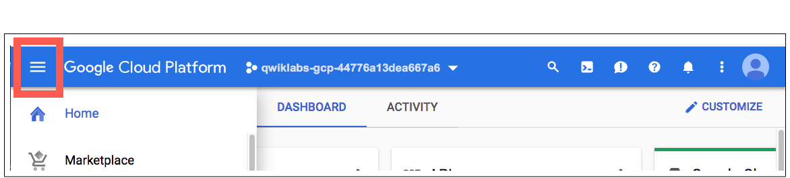
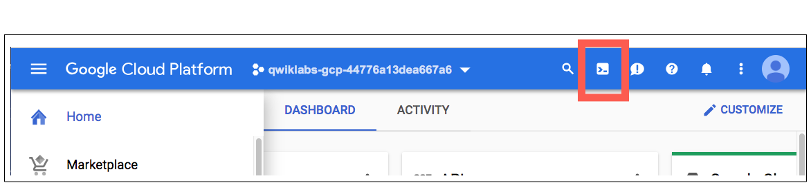
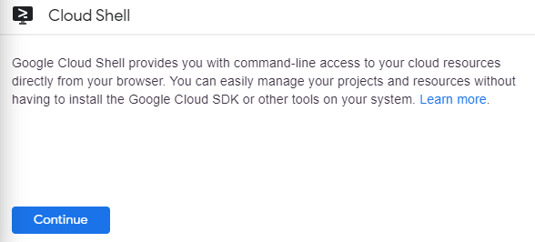
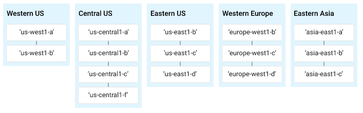

# A hands-on introduction to Sysdig

## CE070

## Introduction<!--## makes table of contents-->
Duration: 90 minutes

### What you'll learn
I'm Tom .  
Using troubleshooting playbooks  
Creating and exploring with log based metrics  
Using Log Analytics 


## Setup

**Before you click the Start Lab button**

Read these instructions. Labs are timed and you cannot pause them. The timer, which starts when you click Start Lab, shows how long Google Cloud resources will be made available to you.

This hands-on lab lets you do the lab activities yourself in a real cloud environment, not in a simulation or demo environment. It does so by giving you new, temporary credentials that you use to sign in and access Google Cloud for the duration of the lab.

To complete this lab, you need:

* Access to a standard internet browser (Chrome browser recommended).

<div><ql-infobox>

**Note:** Use an Incognito or private browser window to run this lab. This prevents any conflicts between your personal account and the Student account, which may cause extra charges incurred to your personal account.
</ql-infobox></div>

* Time to complete the lab---remember, once you start, you cannot pause a lab.

<div><ql-infobox>

**Note:** If you already have your own personal Google Cloud account or project, do not use it for this lab to avoid extra charges to your account.
</ql-infobox></div>

**How to start your lab and sign in to the Google Cloud Console**

1. Click the **Start Lab** button. If you need to pay for the lab, a pop-up opens for you to select your payment method. On the left is a panel populated with the temporary credentials that you must use for this lab.



2. Copy the username, and then click Open Google Console. The lab spins up resources, and then opens another tab that shows the Sign in page.



***Tip:*** Open the tabs in separate windows, side-by-side.

If you see the **Choose an account** page, click **Use Another Account**.



3. In the **Sign in** page, paste the username that you copied from the left panel. Then copy and paste the password.

**Important:** You must use the credentials from the left panel. Do not use your Google Cloud Training credentials. If you have your own Google Cloud account, do not use it for this lab (avoids incurring charges).

1. Click through the subsequent pages:

* Accept the terms and conditions.
* Do not add recovery options or two-factor authentication (because this is a temporary account).
* Do not sign up for free trials.

After a few moments, the Cloud Console opens in this tab.

<div><ql-infobox>

**Note:** You can view the menu with a list of Google Cloud Products and Services by clicking the **Navigation menu** at the top-left.
</ql-infobox></div>



**Activate Cloud Shell**

Cloud Shell is a virtual machine that is loaded with development tools. It offers a persistent 5GB home directory and runs on the Google Cloud. Cloud Shell provides command-line access to your Google Cloud resources.

In the Cloud Console, in the top right toolbar, click the **Activate Cloud Shell** button.



Click **Continue**.



It takes a few moments to provision and connect to the environment. When you are connected, you are already authenticated, and the project is set to your *PROJECT_ID*. For example:


`gcloud` is the command-line tool for Google Cloud. It comes pre-installed on Cloud Shell and supports tab-completion.

You can list the active account name with this command:

```
gcloud auth list
```

(Output)

```console
ACTIVE: *
ACCOUNT: student-01-xxxxxxxxxxxx@qwiklabs.net
To set the active account, run:
    $ gcloud config set account `ACCOUNT`
```

You can list the project ID with this command:

```
gcloud config list project
```

(Output)

```console
[core]
project = <project_ID>
```

(Example output)

```console
[core]
project = qwiklabs-gcp-44776a13dea667a6
```

<div><ql-infobox>

For full documentation of gcloud see the *gcloud*  [command-line](https://cloud.google.com/sdk/gcloud) tool overview.
</ql-infobox></div>

**Understanding Regions and Zones**

Certain Compute Engine resources live in regions or zones. A region is a specific geographical location where you can run your resources. Each region has one or more zones. For example, the us-central1 region denotes a region in the Central United States that has zones `us-central1-a`, `us-central1-b`,`us-central1-c`, and `us-central1-f`.



Resources that live in a zone are referred to as zonal resources. Virtual machine Instances and persistent disks live in a zone. To attach a persistent disk to a virtual machine instance, both resources must be in the same zone. Similarly, if you want to assign a static IP address to an instance, the instance must be in the same region as the static IP.

*Learn more about regions and zones and see a complete list in (* [*Regions & Zones documentation*](https://cloud.google.com/compute/docs/regions-zones/)*).*

<!--Change this content for lab-->
## Task 1: Generate some traffic on example app
Start generating some traffic by running locust.io against your application.
Open the CloudShell icon

1. Get the IP of your applications load balancer with the following command:
```
gcloud compute addresses list --filter=name="lb-static-ip"
```

With an example output like:
```
NAME: lb-static-ip
ADDRESS/RANGE: 34.110.182.81
TYPE: EXTERNAL
PURPOSE: 
NETWORK: 
REGION: 
SUBNET: 
STATUS: IN_USE
```

2. Set the following variable with the value from the `ADDRESS/RANGE` field:
`FRONTEND_ADDR=IP_ADDRESS`

3. Run the following commands to generate traffic against your application 
```
pip install locust
wget https://raw.githubusercontent.com/GoogleCloudPlatform/microservices-demo/main/src/loadgenerator/locustfile.py
locust --host="http://${FRONTEND_ADDR}" --headless -u "${USERS:-10}" 2>&1
```


## Task 2: Explore GKE In-Context tools
 1. Navigate to GKE page and select clusters
 2. Select the my-cluster-emea1
 3. Select the 'observability' tab and observe all the components automatically availabe

 ## Task 3: Use Troubleshooting Playbooks to identify issues
 1. Click 'connect' and connect to your GKE cluster via CloudShell
 2. Run the following command:
    `kubectl apply -f https://raw.githubusercontent.com/kyleabenson/errorApp/master/deployment.yaml`
 3. Navigate to 'workloads' and watch as app struggles and repeatedly restarts, click on notification after several minutes to use Troubleshooting playbook
 4. Delete this deployment `kubectl delete -f https://raw.githubusercontent.com/kyleabenson/errorApp/master/deployment.yaml`

 ## Task 4: Use automatic telemetry tools to explore the app 
 1. In the Cloud Console, return to the workloads page. On the Navigation menu (In the Cloud Console, on the **Navigation menu** ( ), click **Kubernetes Engine** &gt; **Workloads**.), click Kubernetes Engine &gt; Workloads.
 2. Select the 'frontend' workload
 3. On the deployment details page, select the 'Container Logs' link to enter into the Logs Explorer. Notice that this keeps all the prior context and loads the logs for the specific deployment.
 Enter the following Log Query:

 ```
 resource.type="k8s_container"
resource.labels.location="us-west1"
resource.labels.cluster_name="my-cluster-usa-1"
resource.labels.namespace_name="frontend"
labels.k8s-pod/app="frontend"
jsonPayload."http.req.path":"/product/" AND jsonPayload.message = "serving product page"
 ```

 4.  Select 'Create Metric' to create a logs based metric based on the above search query, saving the metric as a 'Counter' type.
 5. Explore this metric in the Metrics Explorer
 6. While in the metrics explorer, select the 'Code:PromQL' button to see this command converted to PromQL automatically.

## Exploring logs with Log Analytics
1. Enable Log Analytics on your default bucket
2. In the Navigation menu, (In the Cloud Console, on the **Navigation menu** ( ), click **Cloud Logging** &gt; **Log analytics**.), click Cloud Logging &gt; Log Analytics.
Enter the following into the SQL field:
```
SELECT
JSON_VALUE(json_payload, '$."http.req.path"') as path, JSON_VALUE(json_payload, '$."http.resp.status"') as code, COUNT(*) AS count
FROM
  `ops-demo-330920.global._Default._AllLogs`

WHERE log_id = "stdout" AND JSON_VALUE(json_payload, '$."http.req.path"')  IS NOT NULL  AND JSON_VALUE(json_payload, '$."http.req.path"') LIKE '%product%'
GROUP BY path, code
ORDER BY count DESC
``````


 


