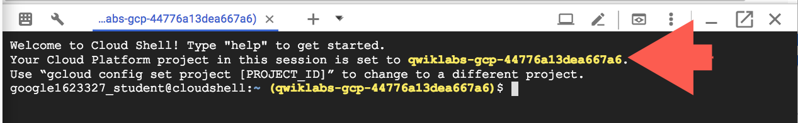

# A hands-on introduction to Sysdig

## CE070

## Introduction<!--## makes table of contents-->
Duration: 90 minutes  
Oriented to DevOps Engineers, SREs, Platform Engineers, Security Architects.

### Key Challenges of Securing the cloud
New cloud approaches and cloud-native applications using container technologies have introduced a new set of challenges in terms of security. Traditional solutions are inadequate for handling this environment complexity and new abstractions. Securing cloud-native applications and infrastructure is not easy, even for professionals.

Some interesting facts described on [Sysdig Global Cloud Threat Report](https://sysdig.com/press-releases/2023-cloud-threat-report/)
* **10 Minutes to pain**. Cloud attackers are quick and opportunistic, spending only 10 minutes to initiate an attack.
* **A 90% safe supply chain isn't safe enough**. 10% of advanced supply chain threats are invisible to standard tools.
* **72% of containers live less than five minutes**. Gathering information after a container is done is not effective.
* **87% of Container Images have high risk vulnerabilities**. And several new vulnerabilities are discovered every day.

Companies around the world have to deal with complexity:
* Scale. Large volumes of dynamic cloud assets, configurations and permissions.
* Microservices, distributed infrastructure, CICD pipelines. 
* Multiple teams (Devs, DevOps, Security). 

### What you'll learn
Understand Sysdig's unique security approach and its **unified Platform**.
* **Vulnerability Management**
  * Detect, manage and remediate container and hosts vulnerabilities from CICD to run.
  * Reduce noise dramatically thanks to Runtime Insights (in-use).
* **Cloud Security Posture**
  * Detect and fix misconfigurations and risks with CSPM, KSPM and CIEM features.
  * Enforce Security Posture with Runtime Insights findings.
* **Threat Detection and Response**
  * Runtime threats and Falco basics.
  * Cloud Threat Detection (Auditlog).
  * GKE runtime threat detection.

  


### Prerequisites

Google Qwiklabs will take care of provisioning required accounts, infrastructure including clusters, terminal shell with bastion VM, etc. So all that you need is:

  * A laptop/computer with internet access.
  * Be eager to dig deeper on cloud security.

## Setup

### Sysdig

==TODO: Pending generation of accounts==

### Lab

**Before you click the Start Lab button**

Read these instructions. Labs are timed and you cannot pause them. The timer, which starts when you click Start Lab, shows how long Google Cloud resources will be made available to you.

This hands-on lab lets you do the lab activities yourself in a real cloud environment, not in a simulation or demo environment. It does so by giving you new, temporary credentials that you use to sign in and access Google Cloud for the duration of the lab.

To complete this lab, you need:

* Access to a standard internet browser (Chrome browser recommended).

<div><ql-infobox>

**Note:** Use an Incognito or private browser window to run this lab. This prevents any conflicts between your personal account and the Student account, which may cause extra charges incurred to your personal account.
</ql-infobox></div>

* Time to complete the lab---remember, once you start, you cannot pause a lab.

<div><ql-infobox>

**Note:** If you already have your own personal Google Cloud account or project, do not use it for this lab to avoid extra charges to your account.
</ql-infobox></div>

**How to start your lab and sign in to the Google Cloud Console**

1. Click the **Start Lab** button. If you need to pay for the lab, a pop-up opens for you to select your payment method. On the left is a panel populated with the temporary credentials that you must use for this lab.


2. Copy the username, and then click Open Google Console. The lab spins up resources, and then opens another tab that shows the Sign in page.


***Tip:*** Open the tabs in separate windows, side-by-side.

If you see the **Choose an account** page, click **Use Another Account**.


3. In the **Sign in** page, paste the username that you copied from the left panel. Then copy and paste the password.

**Important:** You must use the credentials from the left panel. Do not use your Google Cloud Training credentials. If you have your own Google Cloud account, do not use it for this lab (avoids incurring charges).

1. Click through the subsequent pages:

* Accept the terms and conditions.
* Do not add recovery options or two-factor authentication (because this is a temporary account).
* Do not sign up for free trials.

After a few moments, the Cloud Console opens in this tab.

<div><ql-infobox>

**Note:** You can view the menu with a list of Google Cloud Products and Services by clicking the **Navigation menu** at the top-left.
</ql-infobox></div>


**Activate Cloud Shell**

Cloud Shell is a virtual machine that is loaded with development tools. It offers a persistent 5GB home directory and runs on the Google Cloud. Cloud Shell provides command-line access to your Google Cloud resources.

In the Cloud Console, in the top right toolbar, click the **Activate Cloud Shell** button.


Click **Continue**.


It takes a few moments to provision and connect to the environment. When you are connected, you are already authenticated, and the project is set to your *PROJECT_ID*. For example:



`gcloud` is the command-line tool for Google Cloud. It comes pre-installed on Cloud Shell and supports tab-completion.

You can list the active account name with this command:

```
gcloud auth list
```

(Output)

```console
ACTIVE: *
ACCOUNT: student-01-xxxxxxxxxxxx@qwiklabs.net
To set the active account, run:
    $ gcloud config set account `ACCOUNT`
```

You can list the project ID with this command:

```
gcloud config list project
```

(Output)

```console
[core]
project = <project_ID>
```

(Example output)

```console
[core]
project = qwiklabs-gcp-44776a13dea667a6
```

<div><ql-infobox>

For full documentation of gcloud see the *gcloud*  [command-line](https://cloud.google.com/sdk/gcloud) tool overview.
</ql-infobox></div>

## Task 1: Onboard Sysdig
Please Log in to your Sysdig account using credentials generated by this lab at the beginning.
<sub>*(i.e. url: https://app.us4.sysdig.com/secure user: my-user@gmail.com pwd: A8!#2rq@).*</sub>

You should see Sysdig's home dashboard screen.


### Connect your GCP Account (agentless)
Browse to <span style="color:DimGray ">*Integrations > Cloud Accounts > Connect GCP sysdig-onboard-gcp.png*</span>

Populate required fields with **GCP Region** (i.e. *us-central1*) and **Project ID** (i.e. *my-company-project*), and copy-paste auto generated Terraform code into a main.tf file following dialog instructions.


Provision resources by executing the script in your terminal shell.

``
  terraform init && terraform apply
``

After the onboarding process, please check that your new GCP account appears on the list of Data Sources from <span style="color:DimGray ">*Integrations > Cloud Accounts*</span>

As of now, any security event happening in your GCP account and services will be detected and analyzed by Sysdig. We will show more details in further chapters.

### Connect GKE agents for deeper visibility
Browse to <span style="color:DimGray ">*Integrations > Sysdig Agents > Connect a Kubernetes cluster*</span>

Specify a meaningful cluster name (i.e. *gke-workshop*) and copy the auto generated helm command. Execute it in your terminal, it will take no more than 1 minute to get your agents installed and protecting the GKE cluster.


After the helm installation is done, please check that your new GKE cluster is now listed on the Data Sources agents screen <span style="color:DimGray ">*Integrations > Sysdig Agents*</span>

We will explain soon how to detect and respond to suspecting events.

## Task 2: Vulnerability Management
**From code to run with Sysdig**
Sysdig provides coverage to the complete software lifecycle with continuous scanning for:
- Local environments and CICD pipelines with Sysdig CLI
- GCR Registies
- Runtime container images

 ## Task 3: Runtime Threat Detection and Response
==Lorem ipsum==

 ### Cloud threat detection (agentless)

==Lorem ipsum==

 ### GKE threat detection

 ==Lorem ipsum==

 ## Task 4: Posture Management
 1. In the Cloud Console, return to the workloads page. On the Navigation menu (In the Cloud Console, on the **Navigation menu** ( ), click **Kubernetes Engine** &gt; **Workloads**.), click Kubernetes Engine &gt; Workloads.
 2. Select the 'frontend' workload
 3. On the deployment details page, select the 'Container Logs' link to enter into the Logs Explorer. Notice that this keeps all the prior context and loads the logs for the specific deployment.
 Enter the following Log Query:

 ```
 resource.type="k8s_container"
resource.labels.location="us-west1"
resource.labels.cluster_name="my-cluster-usa-1"
resource.labels.namespace_name="frontend"
labels.k8s-pod/app="frontend"
jsonPayload."http.req.path":"/product/" AND jsonPayload.message = "serving product page"
 ```

 4.  Select 'Create Metric' to create a logs based metric based on the above search query, saving the metric as a 'Counter' type.
 5. Explore this metric in the Metrics Explorer
 6. While in the metrics explorer, select the 'Code:PromQL' button to see this command converted to PromQL automatically.

## Exploring logs with Log Analytics
1. Enable Log Analytics on your default bucket
2. In the Navigation menu, (In the Cloud Console, on the **Navigation menu** ( ), click **Cloud Logging** &gt; **Log analytics**.), click Cloud Logging &gt; Log Analytics.
Enter the following into the SQL field:
```
SELECT
JSON_VALUE(json_payload, '$."http.req.path"') as path, JSON_VALUE(json_payload, '$."http.resp.status"') as code, COUNT(*) AS count
FROM
  `ops-demo-330920.global._Default._AllLogs`

WHERE log_id = "stdout" AND JSON_VALUE(json_payload, '$."http.req.path"')  IS NOT NULL  AND JSON_VALUE(json_payload, '$."http.req.path"') LIKE '%product%'
GROUP BY path, code
ORDER BY count DESC
``````


 


